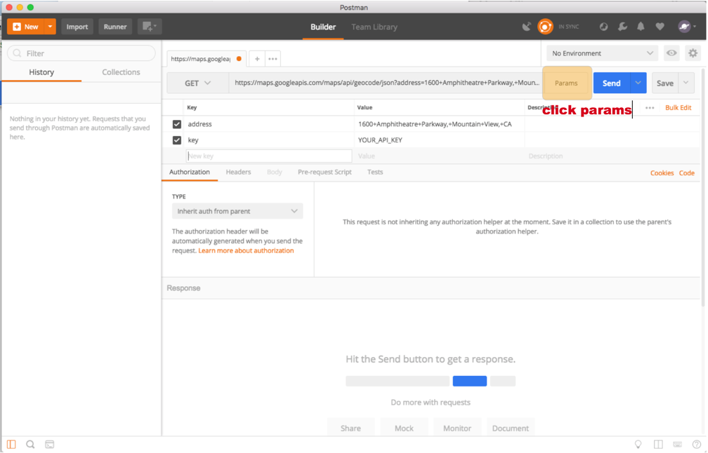
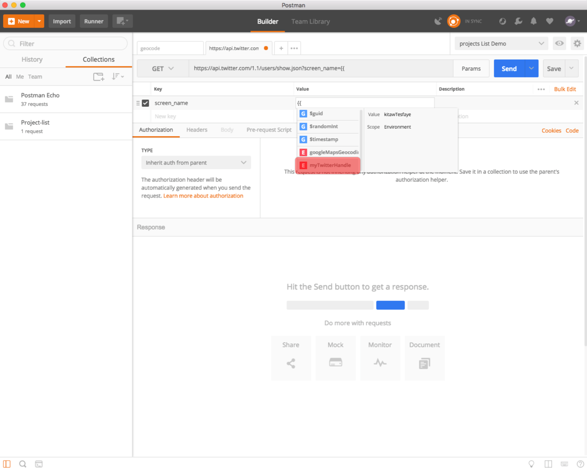

### Explore google map
> [Go to](https://developers.google.com/maps/documentation/geocoding/start)
> [Get google API key](https://developers.google.com/maps/documentation/geocoding/start#get-a-key)


> The folowing request the latitude and longtude of "1600 Amphitheatre Parkway, Mountain View, CA"

https://maps.googleapis.com/maps/api/geocode/json?address=1600+Amphitheatre+Parkway,+Mountain+View,+CA&key=YOUR_API_KEY



> Now we can past API KEY for the key value, but the best pactice is to use variables

> Replace "YOUR_API_KEY" with {{googleMapsGeocodingApiKey}}


> Open enviroment manager


> Make sure you have selected the new enviroment


> Now let us hit send

### How to autorize OAuth 1 using postman
> [We will use twiter api](https://developer.twitter.com/)


[GET user/show](https://developer.twitter.com/en/docs/accounts-and-users/follow-search-get-users/api-reference/get-users-show)

> To access api create OAuth token


> https://developer.twitter.com/en/docs/accounts-and-users/follow-search-get-users/api-reference/get-users-show


### Save your first request in a collection





### Writing a test in postman

```js
pm.test("Status code is 200", function () {
    pm.response.to.have.status(200);
});
```


### More test on postman
```js
pm.test("Nmae of the test", function to be evaluated to true or false;)
});
```
```js
pm.test("Response includes results", function () {
    pm.expect(pm.response.json()).to.include.keys("results");
});
```


### What if you want to run the test over and over in the entire collection?


### How do we save from googleapi the longtiude and latitude values to a variable so we can use it later.

> Test
```js
pm.test("Status code is 200", function () {
    pm.response.to.have.status(200);
});
pm.test("Response includes results", function () {
    pm.expect(pm.response.json()).to.include.keys("results");
});

let firstResponse = pm.response.json().results[0];
let lat = firstResponse.geometry.location.lat;
let lng = firstResponse.geometry.location.lng;

pm.enviroment.set('lat', lat);
pm.enviroment.set('lng', lng);
````


> Now check the enviromental variables


> Now we have saved the variable in the enviroment variable.
### How to use dynamicaly saved variable in another request.

### [Go to google places api](https://developers.google.com/places/web-service/search)


